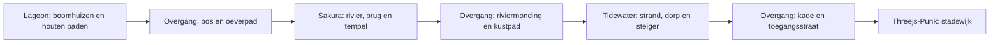

# Vier bestaande scènes in één bewandelbare Threetopia-wereld

Onderzocht op 27 september 2026: Tidewater, Threejs-Punk, Sakura River Valley en Lagoon Tree Village. Meadow en Little Birds vallen buiten dit onderzoek.

**Conclusie: technisch haalbaar, met echte onderdelen uit de oorspronkelijke projecten.** De reconstructie van Lagoon en Sakura werkt lokaal. Een beperkte proef met de oorspronkelijke Punk-stad en de procedureel opgebouwde Tidewater-steiger draait in één Three.js r186/WebGPU-renderer. De volledige vier scènes zijn nog niet samengevoegd. De belangrijkste resterende werkzaamheden zijn shaderports, gezamenlijk water/licht, ruimtelijke uitsneden en doorlopende looproutes.

De huidige landingpage en `/world/` zijn tijdens dit onderzoek niet aangepast. Er is niets gepubliceerd. Bronkopieën en uitvoerbare proeven staan in de gitignored map `.context/integration-lab/`.

## Bronnen en herbruikbaarheid

| Gebied | Onderzochte bron | Behoud van echte onderdelen | Benodigde aanpassing |
| --- | --- | --- | --- |
| Tidewater — Dan Greenheck | [Repository](https://github.com/dgreenheck/tidewater); Three.js-revisie `d32799fcd85b79fb2fde3c4254f9d3805edecee3` | Eilandhoogtes, procedureel dorp en steiger, vegetatie, oceaan, boot, loop-/zwemlogica en TSL-materialen | Applicatie uit elkaar halen in gebiedscomponenten; renderer, speler, atmosfeer en water aan de host overdragen |
| Threejs-Punk — Anderson Mancini en Sunag | [Repository](https://github.com/ektogamat/threejs-conference/tree/8cc20593b2270e2ce832e7b7b44356705daddec4), revisie `8cc20593b2270e2ce832e7b7b44356705daddec4` | GLB-stad, broncode voor regen/natte oppervlakken, bronloader, BVH-collision en first-person besturing | Bestaande onzichtbare grens openen; gebiedslicht, regen en effecten inpassen in gedeelde runtime |
| Sakura River Valley — Meng To | [Openbare demo](https://valley.mengto.here.now/), `scene-SV5IBQX7.js` en 45 gerefereerde assets | Oorspronkelijke terreinfunctie, rivier, procedurele tempel/bomen/boot, modellen en texturen | Bundel in modules scheiden; GLSL-materialen naar TSL overzetten; landcolliders en lopende besturing toevoegen |
| Lagoon Tree Village — cryptomanavan | [Openbare demo](https://lagoon-tree-village.netlify.app/), `index-BjH0GYGf.js` met 40 JavaScript-bestanden in totaal | Werkelijke huisjes, bomen, terrein, bruggen, trappen, textuurgeneratie, looproutes en collision | Gevonden `build(context)`-modules als adapters ontsluiten; shaders en renderer-afhankelijke effecten porten |

Dit zijn grotendeels zelfstandige apps met veel eigen code. Het zijn geen vier bestaande installeerbare Threetopia-pakketten. We kunnen hun echte componenten verpakken als lokale workspace-packages, met oorspronkelijke makers, URL, revisie/hash en afhankelijkheden in het pakketregister. Voorgestelde pakketnamen zijn nog geen gepubliceerde npm-pakketten.

Tidewaters huidige `main` is óók onderzocht, op revisie `4811ba48d795197de5621985f404e765c0b7c0ef`. Die gebruikt inmiddels een eigen WebGPU-engine. De oudere Three.js-versie hierboven is een concrete, veel eenvoudigere integratiebasis, maar bevat niet alle latere functies, waaronder het nieuwere vissysteem. Als de huidige live demo volledig het doel is, moeten die latere wijzigingen afzonderlijk worden geport. Deze keuze mag niet stilzwijgend als volledige pariteit worden gepresenteerd.

## Wat daadwerkelijk getest is

| Proef | Uitkomst | Wat hiermee nog niet bewezen is |
| --- | --- | --- |
| Lagoon lokaal reconstrueren uit publieke bestanden | Alle 21 gerapporteerde modules `ok`; `ready: true`; lege foutlijst. Originele scène zichtbaar in browser. | Een WebGPU-port of integratie met andere gebieden |
| Sakura lokaal reconstrueren | Originele scène inclusief boot, tempel, begroeiing en water zichtbaar; `ready: true`; lege foutlijst. | Lopen op het land of een gedeelde renderer |
| Hoogtefuncties uit beide minified builds isoleren | Originele functies werken zonder de eigen app op te starten; land- en waterhoogtes numeriek uitgelezen. | Een volledige modulaire bronreconstructie of alle oorspronkelijke namen/comments terughalen |
| Tidewater-terrein en steiger met Three.js r186 uitvoeren | Originele terrein- en steigerbouwers werken. Steiger: 5 meshes, 30.553 driehoeken, 120 boxcolliders en 93 cylindercolliders. | De volledige Tidewater-app, oceaansimulatie of al zijn TSL-materialen op de gezamenlijke host |
| Grondcontrole op Tidewater-steiger | 413 punten op de middenlijn hebben de verwachte dekhoogte van 2,3 m. Een capsule wordt op sommige punten maximaal circa 23 cm zijwaarts geduwd door obstakels. | Een volledig gespeelde looproute; de middenlijn is niet overal obstakelvrij |
| Punk + Tidewater in één renderer | Eén canvas, één scene, WebGPU-backend, r186, 83 meshes: 78 uit de originele Punk-GLB en 5 uit de originele Tidewater-steigerbouwer. De originele Punk-loader met Draco/KTX2 werkt. Geen browserfouten gerapporteerd. | De steiger gebruikt eenvoudige diagnostische materialen. Originele belichting, video-billboards, water, regen en nabewerking zitten niet in deze proef. Geen visuele pariteit of performancebenchmark. |
| Gedeeld randprofiel met originele Lagoon/Sakura-hoogtes | 257 randpunten: hoogteverschil 0; numerieke afwijking in dwarshelling circa `8,2e-7`. Zonder omkering van randoriëntatie ontstaat bewust 30 cm verschil. | De proef gebruikt een ontworpen synthetisch profiel, geen reeds bestaande aansluiting. Volledige hexhoeken, collider-meshes en gameplay zijn nog niet gekoppeld. |

De laatste proef laat ook een probleem zien: een overgangsband van 12 m per kant kan hier intern circa 58° steil worden. Een naadloos oppervlak is dus nog geen begaanbaar pad. We moeten hoogteverschillen met een langere route, hellingbaan, trap, brug of anders gekozen aansluiting oplossen.

Bewijsbestanden:

- `.context/integration-lab/analysis/lagoon-runtime.json`
- `.context/integration-lab/analysis/sakura-runtime.json`
- `.context/integration-lab/analysis/cpu-probe.json`
- `.context/integration-lab/analysis/source-probe.json`
- `.context/integration-lab/analysis/gpu-probe.json`
- `.context/lagoon-local-reconstruction.png`
- `.context/sakura-local-reconstruction.png`
- `.context/shared-renderer-probe.png`

## Gedeelde renderer en shaders

De onderzochte Lagoon- en Sakura-bundels bevatten beide Three.js r186 met `WebGLRenderer`. Tidewaters oudere bron gebruikt `three ^0.186.0` met WebGPU/TSL; Punk gebruikt `three ^0.185.1` met WebGPU/TSL. De beperkte gezamenlijke GPU-proef ondersteunt r186 als startpunt. De bestaande landing gebruikt r184 en is hiervoor niet geüpgraded.

Aanbevolen: één expliciet gepinde Three.js-versie, één `WebGPURenderer`, één scene, één camera en één frame-loop. Gebieden krijgen via de host hun tijd, oorsprong, input, verlichting, waterinformatie en resourcebeheer.

De [Three.js-migratiedocumentatie](https://threejs.org/manual/pages/webgpurenderer.html) bevestigt dat `ShaderMaterial`, `RawShaderMaterial` en `onBeforeCompile` niet in `WebGPURenderer` worden ondersteund. Ook diens WebGL-backend maakt oude GLSL-hooks niet bruikbaar. Die moeten naar node-materialen/TSL worden overgezet; klassieke effectketens moeten eveneens worden aangepast.

In de lokaal gebouwde Lagoon-scène telde de probe 59 materiaalobjecten, waaronder 9 `ShaderMaterial`s en 48 materialen met een eigen `onBeforeCompile`. Sakura had 62 materiaalobjecten, waaronder 18 `ShaderMaterial`s en 44 eigen hooks. Dit zijn materiaalinstanties, geen aantallen onafhankelijke porttaken: veel delen dezelfde shaderlogica. Het maakt wel duidelijk dat alleen `renderer` vervangen de uitstraling niet behoudt.

Portvolgorde: terrein/PBR, architectuur, bomen en wind, water, vervolgens atmosfeer en nabewerking. Per familie vaste camerastandpunten vergelijken met de lokaal werkende oorspronkelijke demo. De oorspronkelijke geometrie, texturen, seeds, plaatsing en parameters behouden waar mogelijk.

De vier apps hebben daarnaast eigen globale aannames. Sommige shaders gebruiken wereldcoördinaten voor terreintextures, wind, waterdiepte en reflectie. Een `Group.position` veranderen is daarom onvoldoende: elke adapter moet wereldcoördinaten en oorspronkelijke lokale coördinaten expliciet omzetten, inclusief colliderqueries en shader-samplers.

## Schaal, lopen en hexagonale Wang-tiles

Gemeten of direct uit de oorspronkelijke configuratie:

| Gebied | Oorspronkelijke omvang/aansluiting | Gevolg |
| --- | --- | --- |
| Tidewater | Hoogteveld 2048 × 2048 m; dorpstraal 95 m; steiger 104 m lang, 2,6 m breed, dekhoogte 2,3 m; zeepeil 0 | Kern, kust en achtergrond apart beheren; volledige omgeving beslaat veel cellen |
| Lagoon | Dorpstraal 110 m; `nearTerrainHalf: 320`; verre achtergrond tot 5200 m; waterpeil 0 | Dorpscluster met meerdere cellen en begrensde verre achtergrond |
| Sakura | Actieve vaarroute van z=150 tot z=-330: 480 m; brug van x=-14,5 tot x=18,5, breedte 3,6 m; waterpeil 0 | Langgerekt riviercluster; oeverpad en brug als voetgangersroute toevoegen |
| Punk | Conservatieve GLB-bounds circa 412 × 281 horizontale scene-eenheden; afzonderlijke grenscollider circa 276 × 276 | Stadskern over meerdere cellen; aansluitstraat uitzoeken en grens daar openen |

Punks bounds zijn berekend uit genormaliseerde glTF-accessors en de volledige node-transformaties, inclusief de oorspronkelijke Y-offset -20. Het zijn geen metingen van de begaanbare vloer. De daadwerkelijke straathoogte moet via de geladen geometrie/collider worden bepaald, niet met de laagste bounding-boxwaarde.

Een vaste hexagonstraal van bijvoorbeeld 128 m is een bruikbare start om met footprints te experimenteren, geen al gevalideerde optimale maat. De bestaande voorbeelden van 50 m straal kunnen voor kleinere onderdelen blijven dienen. De complete demo's moeten niet worden verkleind tot speelgoed om binnen één tegel te passen. Een groot object of gebouw kan meerdere cellen beslaan, met één eigenaar voor laden/verwijderen.

Voorstel voor de route:

Dit is een voorgesteld traject, nog geen ruimtelijk uitgewerkte wereldkaart. De voetganger kan alle gebieden over paden en bruggen bereiken; de boot blijft optioneel.

Een hexrand moet meer bevatten dan een kleur of biomenaam. Het contract uit `docs/hex-world-proposal.md` blijft bruikbaar en moet worden gekoppeld aan echte geometrie:

- Hoogteprofiel, normale/helling, materiaalverdeling en omgekeerde samplevolgorde op de buurzijde.
- Waterhoogte, stroomrichting, oevers en overgang van golfbeweging; hetzelfde gemiddelde zeepeil voorkomt nog geen bewegende waternaad.
- Padpositie, breedte, richting, helling, vrije capsulehoogte en colliders aan beide kanten.
- Gedeelde hoekpunten waar drie tegels samenkomen, met consistente hoogtes en materiaalovergangen.
- Exact dezelfde lokale/wereldtransformatie voor zichtbare geometrie, hoogtequeries en botsingen.
- Alle zes rotaties van een hexagon, plus controle dat de gewenste looproute globaal bereikbaar blijft.

Begin met een bewust ontworpen kaart en enkele overgangstegels. Daarna kunnen extra compatibele varianten door Wang-matching worden gekozen. Willekeurig tegels met hetzelfde label naast elkaar zetten garandeert geen logische rivier of bereikbare route.

Eén speler wordt eigenaar van de beweging. Lagoon levert bruikbare capsulematen (hoogte 1,8 m, ooghoogte 1,68 m, radius 0,32 m) en bestaande trap/brug-collision. Tidewater heeft eigen grond-, obstakel- en zwemqueries. Punk heeft mesh-BVH-collision. Sakura bestuurt nu een boot en heeft geen complete landcontroller. De host moet deze verschillende colliderbronnen via één interface benaderen en bij het oversteken beide buurtegel-colliders tegelijk actief houden.

## Licht, water en laden

Vier losse sky-, water- en postprocessystemen kunnen niet elk de volledige gedeelde scene behandelen. Ze zouden elkaar overschrijven, water dubbel tekenen en veel werk herhalen. Kies een gedeelde klok, zon/atmosfeer en postprocessketen. Bewaar gebiedseigen accenten zoals neon, bloemen, lokaal weer, rivierstroming en tropische begroeiing. Gebruik geleidelijke overgangen in belichting/mist. De vier oorspronkelijke demo's kunnen onder één hemel niet op elk moment exact hun afzonderlijke tijdstip en kleurcorrectie houden.

Voor water: één host-waterinterface met dezelfde tijd, hoogte- en normalsampling, plus lokale uitwerking voor oceaan, rivier en lagune. Port de oorspronkelijke effecten waar bruikbaar; plan expliciet een blendzone voor stroming, golven, schuim en reflecties. Dit is een groot integratieonderdeel dat nog niet getest is.

De runtime houdt het huidige cluster, zichtbare buren en verwachte loopburen gereed. Downloaden, workers, BVH-bouw en shadercompilatie moeten vóór aankomst plaatsvinden. Zichtbare verre landschappen krijgen een grovere representatie. Elke adapter krijgt `load`, `prepare`, `update`, `dispose`, een footprint, colliderregistratie en expliciete resource-eigendom.

De oorspronkelijke Lagoon-scène had in deze configuratie 409 meshes; Sakura 270, naast veel instanties. De GPU-proef met 83 meshes meet alleen compatibiliteit. Er is nog geen betrouwbare gezamenlijke framerate, mobiel budget of geheugentest. Sakura's oorspronkelijke `renderer.info.render.calls` geeft bij deze snapshot de laatste fullscreen-pass weer en is dus geen bruikbaar totaal voor de scène. Performance moet op de uiteindelijke frameketen en vaste hardware worden gemeten.

## Concrete bouwvolgorde

1. Maak `world-runtime` met gepinde Three.js-versie, gedeelde speler/camera, coördinaten, collision-adapters en lifecycle. Maak lokale bronpackages voor de vier gebieden; registreer herkomst en originele versus aangepaste bestanden.
2. Integreer een origineel Tidewater-deel met de originele Punk-stad. Leg een werkelijke loopverbinding aan, open de grenscollider en test beide richtingen. Behoud daarbij de oorspronkelijke materialen/effecten die al op TSL zitten.
3. Port Lagoon per materiaalfamilie en behoud zijn bestaande architectuur, paden, trappen en colliders. Vergelijk telkens met de lokaal gereconstrueerde referentie.
4. Splits Sakura's applicatiebundel, port de shaders, voeg oever/brug/tempel-collision toe en zet de automatische bootlus buiten de voetgangersbesturing.
5. Bouw de drie overgangsgebieden en maak de hexcontracten leidend voor terreingeometrie, water en collision. Test tegelrotaties, drievoudige hoeken en routebereikbaarheid.
6. Test streaming en herhaald betreden/verlaten: shadercompilatie, dispose, geheugen, LOD en eventuele haperingen. Pas daarna de publieke `/world/` aan.

Een eerste echte mijlpaal is een korte route tussen twee oorspronkelijke gebieden, met één speler en zonder laadscherm, camerasprong of zichtbare grondnaad. Acceptatie voor de uiteindelijke versie: alle vier gebieden in beide richtingen lopend bereikbaar, oorspronkelijke herkenbare assets/materialen aanwezig, geen onzichtbare grenzen op de route, en geladen colliders vóór de grensovergang. De huidige onderzoeksproeven voldoen nog niet aan die volledige acceptatie.

## Herkomst en hergebruik

Tidewaters code is MIT; [CREDITS.md](https://github.com/dgreenheck/tidewater/blob/d32799fcd85b79fb2fde3c4254f9d3805edecee3/CREDITS.md) beschrijft de aanvullende bronnen. Punks code is MIT, maar de [README](https://github.com/ektogamat/threejs-conference/tree/8cc20593b2270e2ce832e7b7b44356705daddec4#license-and-assets) sluit modellen, texturen, audio en video in `public/` uit van die code-licentie. Voor Lagoon en Sakura is nog geen projectbrede hergebruiklicentie gevonden; Sakura's HTML noemt wel Poly Haven/CC0 voor specifieke assets. De technische reconstructie geeft dus nog geen bevestigd recht om alle vier pakketten met alle assets publiek te distribueren.

De bronkopieën blijven voor dit onderzoek lokaal in `.context/`. Er zijn geen makers benaderd en geen pakketten gepubliceerd.
